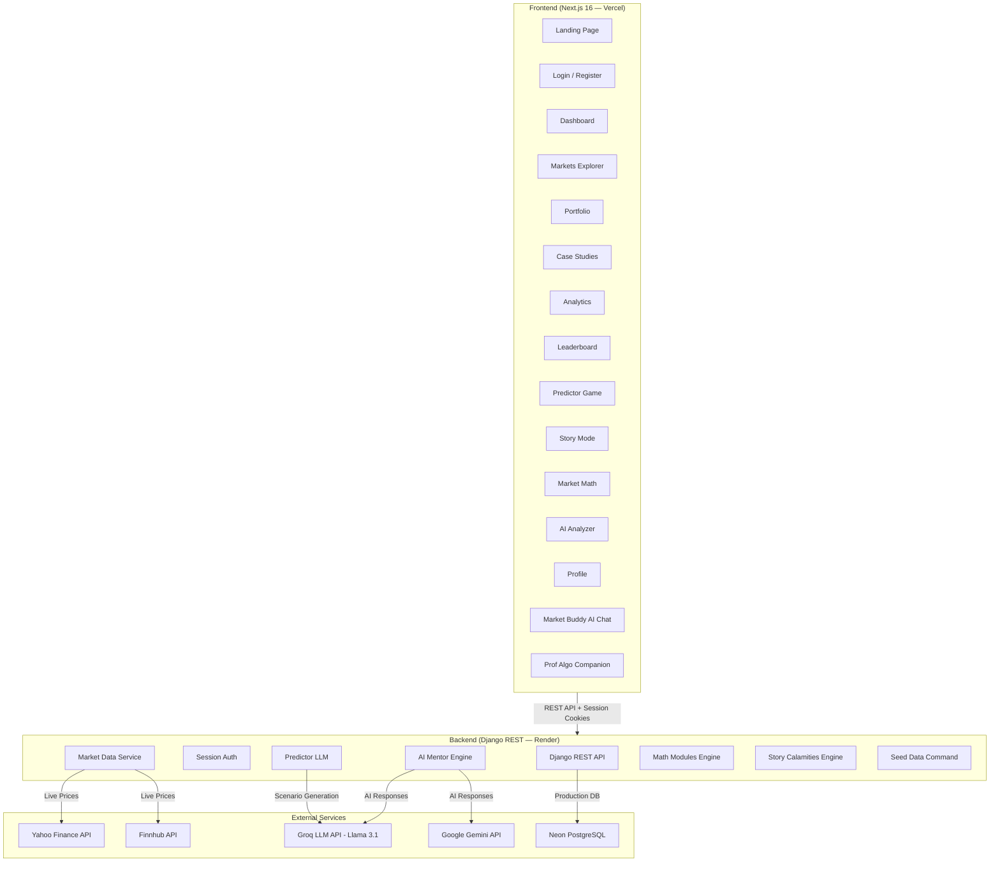
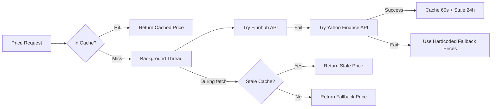

# MarketMind — Complete Project Knowledge Base

> **One-liner**: MarketMind is a **gamified financial literacy platform** that teaches young and beginner investors how stock markets work through virtual trading, AI mentorship, interactive case studies, historical market simulations, and math-based learning — all powered by real-time market data.

---

## 🏗️ Architecture Overview



---

## 🛠️ Tech Stack

### Frontend
| Technology | Version | Purpose |
|---|---|---|
| **Next.js** | 16.2.6 | React framework with App Router |
| **React** | 19 | UI library |
| **TypeScript** | 5.7.3 | Type safety |
| **Tailwind CSS** | 4.2 | Styling |
| **shadcn/ui** | 4.8 | UI component library |
| **Recharts** | 3.8 | Charts and data visualization |
| **Lucide React** | 1.16 | Icon system |
| **Vercel Analytics** | 1.6 | Usage analytics |

### Backend
| Technology | Version | Purpose |
|---|---|---|
| **Django** | 4.2+ | Web framework |
| **Django REST Framework** | 3.14+ | REST API |
| **django-cors-headers** | 4.0+ | Cross-origin support |
| **psycopg2** | 2.9+ | PostgreSQL driver |
| **Gunicorn** | 22+ | WSGI HTTP server |
| **WhiteNoise** | 6.7+ | Static file serving |
| **python-dotenv** | 1.0+ | Environment variables |

### External APIs
| API | Purpose |
|---|---|
| **Yahoo Finance** | Real-time stock prices, historical candle data |
| **Finnhub** | Secondary price source (fallback) |
| **Groq (Llama 3.1 8B)** | AI mentor chat, predictor scenario generation |
| **Google Gemini** | Alternative LLM provider |
| **OpenAI** | Alternative LLM provider |

### Deployment
| Service | Purpose |
|---|---|
| **Vercel** | Frontend hosting |
| **Render** | Backend hosting |
| **Neon PostgreSQL** | Production database |
| **SQLite** | Local development database |

---

## 🔐 Authentication System

- **Method**: Django Session Authentication (cookie-based)
- **Flow**: Register → Login → Session cookie → All API calls include `credentials: 'include'`
- **User Profile**: Each new user starts with **$100,000 virtual cash**
- **Profile fields**: badge, learning_score, risk_score, simulations_completed, portfolio_value, cash, accuracy, bonus_tokens, global_rank

---

## 📊 Data Models (13 Models)

| Model | Purpose |
|---|---|
| **Asset** | Stocks, commodities, industry trackers (20+ curated + dynamic) |
| **UserProfile** | Badge progression, scores, cash, portfolio value |
| **Holding** | User's current stock positions |
| **Trade** | Buy/sell trade history |
| **PortfolioSnapshot** | Portfolio value over time for charting |
| **CaseStudy** | Interactive educational case studies with quizzes |
| **MathModule** | Math-based learning modules |
| **UserMathModuleProgress** | Per-user math module completion tracking |
| **GameChallenge** | Achievement and daily challenge definitions |
| **UserChallenge** | Per-user challenge progress tracking |
| **LeaderboardEntry** | Competitive ranking system |
| **UserCaseStudyCompletion** | Case study quiz scores per user |
| **ProfAlgoMemory** | AI companion's persistent memory of user behavior |

---

## 🎮 Features Deep-Dive

### 1. 🏠 Landing Page
- Beautiful marketing page with feature showcase
- 4 preview case studies (Lemonade Stand, Candy Craze, Egg Basket, Magic Snowball)
- Feature cards: Virtual Trading, Real-World Event Simulation, Interactive Case Studies, AI-Powered Analytics
- Call-to-action buttons for sign-up/login
- **Bilingual support** (English + Hindi)

### 2. 🎓 Onboarding System (Prof. Algo)
- **Typewriter-animated dialogue** with Prof. Algo (AI character)
- Interactive quiz to determine user's experience level (beginner/intermediate/advanced)
- Site tour explaining all features
- Diagnostic questions covering: stocks, supply & demand, diversification, compound interest, bulls & bears
- **Scoring system**: 0-3 = Beginner, 4-6 = Intermediate, 7+ = Advanced

### 3. 📈 Dashboard
- Portfolio value, available cash, total returns, day change — all as stat cards
- Portfolio performance chart (1D/1W/1M/1Y ranges)
- Market grid showing trending stocks with live prices
- **Market Buddy** AI chatbot panel
- **Locked-until-first-case-study** — users must complete at least 1 case study to unlock
- Milestone detection (5+ holdings triggers guided tour)
- Onboarding tour system for first-time users

### 4. 💹 Markets Explorer
- Browse 28 curated assets across 4 categories:
  - **Stocks** (20): AAPL, MSFT, GOOGL, AMZN, NVDA, TSLA, META, NFLX, JPM, V, DIS, NKE, SBUX, KO, PEP, WMT, AMD, COST, LMT, CAT
  - **Industries** (4): Tech, Banking, Healthcare, Energy sector trackers
  - **Commodities** (4): Gold, Crude Oil, Natural Gas, Silver
- Category filter tabs (All, Stocks, Industries, Commodities)
- Search functionality (by name or symbol)
- Live price data from Yahoo Finance/Finnhub
- **Dynamic asset discovery**: If a user searches for an unlisted stock, the backend fetches it from Yahoo Finance and adds it to the database

### 5. 🛒 Trading System
- **Buy/Sell modal** for every asset
- Share quantity input with total cost preview
- Portfolio-aware: validates against available cash (for buys) and current holdings (for sells)
- **Average price tracking**: Weighted average buy price per holding
- Real-time P&L calculation
- **Trade history** with full audit trail

### 6. 💼 Portfolio Management
- Current holdings with live valuations
- Per-holding metrics: shares, avg price, current price, return %, total value
- Portfolio history chart with multiple time ranges
- Cash balance tracking
- **Portfolio snapshots**: Periodic recording of portfolio value for historical charting

### 7. 📖 Case Studies (8 Total)
Interactive educational stories with quizzes, timelines, charts, and key statistics:

#### Beginner Level:
| Case Study | Topic | Read Time |
|---|---|---|
| **The Great Lemonade Stand** | What is a Stock? Dividends | 3 min |
| **The Candy Craze** | Supply & Demand, Price Bubbles | 4 min |
| **Don't Put All Eggs in One Basket** | Diversification | 3 min |
| **The Magic Snowball** | Compound Interest | 3 min |

#### Intermediate Level:
| Case Study | Topic | Read Time |
|---|---|---|
| **Russia–Ukraine Conflict** | Commodities, Defense, Geopolitics | 8 min |
| **COVID-19 Market Crash** | Pandemic, Sector Rotation | 6 min |
| **Interest Rate Hikes** | Monetary Policy, Banking | 7 min |

#### Advanced Level:
| Case Study | Topic | Read Time |
|---|---|---|
| **AI Boom (2023–2025)** | Technology, Semiconductors | 10 min |
| **OPEC Oil Crisis** | Energy policy, supply control | — |

Each case study includes:
- **Rich narrative** with real historical data
- **Interactive timeline** of events
- **Key statistics** (e.g., "S&P 500 Drawdown: -33.9%")
- **Lessons learned** section
- **Chart data** showing price movements
- **Quiz** with 2-10 questions and detailed explanations
- **Score tracking** and completion recording

### 8. 🧮 Market Math (4 Modules)
Hands-on financial math using live portfolio data:

| Module | Difficulty | Topics | Token Reward |
|---|---|---|---|
| **Ratio & Percentage Lab** | Beginner | P/E ratio, % gain/loss, market cap tiers | 25 |
| **Growth & Compounding Lab** | Beginner | Compound interest, Rule of 72, CAGR | 25 |
| **Statistics & Risk Lab** | Intermediate | Volatility, moving averages, correlation | 30 |
| **Portfolio Math Lab** | Intermediate | Weighted returns, risk-return tradeoffs | 30 |

Key technical details:
- Uses **live stock prices** from the user's actual holdings
- Calculates real P/E ratios using curated EPS data for 20 stocks
- Market cap classification: Large (>$10B), Mid ($2-10B), Small (<$2B)
- Quiz questions are dynamically generated from real market data
- Badge track rewards: "Quant Rookie", "Risk Analyst", "Ratio Master"

### 9. 🔮 Market Predictor Game
An AI-powered prediction game built on the user's actual portfolio:

- Shows the user's purchased stocks with real performance data
- **3-phase game per stock**:
  1. **Q1 — Concept Question**: Tests understanding of the news/concept
  2. **Q2 — Price Direction**: Predict if stock goes up strong, up moderate, flat, or down
  3. **Q3 — Strategy Question**: What should an investor do in this situation?
- **LLM-powered scenarios** (Groq/Llama 3.1):
  - Backend generates realistic market scenarios for each stock
  - Includes headline, story, chart data, and 3 questions
  - Falls back to 16+ hardcoded scenarios if LLM is unavailable
- Scoring: concept (25pts), prediction accuracy (50pts max), strategy (25pts)
- Results with detailed chart overlay (predicted vs actual)

### 10. 📚 Story Mode — "The Great Market Calamities"
Interactive historical market simulations guided by Prof. Algo:

#### Available Chapters:
| Chapter | Era | Difficulty | XP Reward |
|---|---|---|---|
| **The Great Crash of 1929** | October 1929 | Beginner | 500 XP |
| **OPEC Oil Embargo** | 1973 | Intermediate | — |
| **Black Monday 1987** | October 1987 | Intermediate | — |
| **Dot-Com Bubble** | 1999-2000 | Advanced | — |
| **2008 Financial Crisis** | 2007-2009 | Advanced | — |

Each chapter features:
- **Historical background** with key concepts defined
- **Step-by-step simulation** with branching decisions
- **Prof. Algo commentary** at each step (personalized reactions)
- **Risk scoring** for each decision option
- **P&L impact** based on player choices
- **Memory tags**: Prof Algo remembers your decisions (e.g., "Prudent Risk Saver", "Aggressive Margin Speculator")
- **Badge rewards** for completion
- **Key indicators** (e.g., Dow Jones Level: 381.17, Margin Debt: 90%)
- **Progressive unlock**: Complete one to unlock the next

### 11. 🤖 AI Market Buddy (Chat)
A conversational AI mentor embedded in the dashboard:

- **Multi-provider LLM support**: Groq (Llama 3.1), Google Gemini, OpenAI
- **Conversation history**: Maintains chat context across messages
- **Portfolio-aware**: Knows user's holdings, cash, portfolio value
- **Real-time market data integration**:
  - Fetches live quotes for mentioned stocks
  - Pulls latest news headlines
  - Builds portfolio context
- **Smart symbol extraction**: NLP-based matching of stock symbols from natural language
- **Guardrails**: Never provides personal financial advice, always educational
- **Fallback mode**: Local deterministic responses when no LLM is configured
- **Bilingual responses** (English/Hindi)

### 12. 🧠 AI Analyzer
Algorithmic analysis of all 28 tracked assets:

- **Decision engine**: BUY / SELL / HOLD recommendations
- **Metrics per asset**: confidence %, trend direction, momentum, volatility
- **Analysis text**: Detailed reasoning for each recommendation
- Filter by decision type and search by symbol/name
- Expandable cards for detailed analysis

### 13. 📊 Analytics Page
Comprehensive user performance dashboard:
- Portfolio value history
- Trade activity breakdown
- Risk score assessment
- Accuracy metrics
- Performance analytics

### 14. 🏆 Leaderboard
Competitive ranking system:
- Ranked by: learning_score → token_count → portfolio_value
- **Metrics shown**: rank, username, portfolio value, tokens, badge, accuracy
- **Auto-sync**: Ranks recalculated on every trade/action
- **Demo user filtering**: Test/demo accounts excluded from rankings
- Token system: Earned from portfolio gains + bonus tokens from challenges

### 15. 🎯 Gamification System

#### Badges (5 tiers):
| Badge | How to Earn |
|---|---|
| 🟢 **Market Rookie** | Default starting badge |
| 🔵 **Value Investor** | Complete 'First Trade' challenge |
| 🟡 **Trend Hunter** | Complete 'Five Profitable Trades' challenge |
| 🟠 **Event Strategist** | Complete 'Portfolio Breaks $105K' challenge |
| 🔴 **Market Legend** | Complete ALL three above challenges |

#### Challenges:
| Challenge | Type | Token Reward | Requirement |
|---|---|---|---|
| **First Trade** | Achievement | 10 | Execute 1 trade |
| **Five Profitable Buys** | Achievement | 50 | 5 profitable buy trades |
| **Portfolio Breaks $105K** | Achievement | 25 | Portfolio > $105,000 |
| **Quant Rookie** | Achievement | 20 | Complete 1 math module |
| **Daily Trader** | Daily | 5 | 1 trade per day |
| **Momentum Builder** | Daily | 10 | 3 trades per day |

#### Token System:
- **Portfolio tokens**: Earned from portfolio growth ($1 token per $1,000 above $100K)
- **Bonus tokens**: Earned from completing challenges
- **Math module tokens**: 25-30 tokens per completed lab

### 16. 🤖 Prof. Algo — AI Floating Companion
A persistent AI character that:
- **Greets users** with personalized messages based on their memory
- **Remembers** past trading decisions, persona, and progress
- **Provides live commentary** during trading
- **Typewriter animation** for speech delivery
- **Chat mode**: Ask Prof. Algo questions directly
- **Minimizable** floating widget

### 17. 📖 Finance Glossary
Smart inline term detection system:
- **SmartTermText component**: Automatically highlights financial terms in any text
- **Click-to-define**: Tapping a highlighted term opens the glossary
- **20+ terms** with kid-friendly definitions:
  - Each term has: emoji, simple definition, everyday analogy, fun fact
  - Categories: Basics, Trading, Growth, Market Trends
  - Examples: Stock (🍕 pizza slice analogy), Portfolio (🎒 backpack analogy), Bull Market (🐂), Bear Market (🐻)

### 18. 🌐 Bilingual Support (English + Hindi)
- Full i18n system with `LanguageContext`
- Dictionary-based translations for all navigation, labels, and common phrases
- Inline translation support via `t('English text', 'Hindi text')` pattern
- Toggle switch accessible from any page
- Persisted preference in localStorage

### 19. 👤 Profile Page
- User details (name, email, username)
- Portfolio statistics
- Badge display
- Experience level
- Global rank

---

## 🔄 Real-Time Market Data Pipeline



- **3-tier caching**: Live cache (60s) → Stale cache (24h) → Hardcoded fallback
- **Non-blocking**: Background thread fetches prevent API call delays
- **Thread-safe**: Lock-based deduplication prevents concurrent fetches for same symbol
- **28 hardcoded fallback prices** ensure the app works even with zero API connectivity

---

## 🧪 Testing

The project includes **312 lines of automated tests** covering:
- Challenge sync system (creating defaults, marking trades complete)
- Leaderboard functionality (user listing, ranking)
- Seed data integrity (demo data cleanup)
- AI Mentor prompt building and symbol extraction
- Trade accuracy calculations
- Badge progression logic
- Registration and authentication flows

---

## 🚀 Deployment Architecture

```
┌──────────────────────┐      ┌───────────────────────┐
│   Vercel (Frontend)  │      │   Render (Backend)     │
│                      │      │                        │
│  Next.js 16 SSR/CSR  │─────▶│  Django + Gunicorn     │
│  Static Assets       │ API  │  WhiteNoise for static │
│                      │      │  Session Auth           │
└──────────────────────┘      └────────┬──────────────┘
                                       │
                              ┌────────▼──────────────┐
                              │  Neon PostgreSQL       │
                              │  (Production DB)       │
                              └────────────────────────┘
```

- **Build pipeline**: `pip install → collectstatic → migrate → seed_data`
- **Environment config**: 10+ environment variables for production
- **CORS/CSRF**: Configured for cross-origin Vercel → Render communication
- **Database**: SQLite (dev) → Neon PostgreSQL (prod) via `dj-database-url`

---

## 🎤 Competition Talking Points

### Problem Statement
> Financial illiteracy is a critical issue — young people enter adulthood without understanding stocks, investing, or how global events impact markets. Traditional learning is boring and theoretical.

### Our Solution
> MarketMind gamifies financial education by letting users:
> 1. **Trade with virtual money** ($100K) using real-time market prices
> 2. **Learn through stories** (kid-friendly case studies + historical crisis simulations)
> 3. **Get AI mentorship** from Prof. Algo, a persistent AI companion
> 4. **Practice financial math** with real portfolio data
> 5. **Compete on a leaderboard** for the best trading performance

### Key Differentiators
1. **Real market data** — Not fake numbers. Yahoo Finance + Finnhub live prices.
2. **AI-powered** — Groq/Llama 3.1 generates dynamic scenarios and provides conversational mentorship.
3. **Progressive learning** — Beginners start with lemonade stand stories, advanced users navigate the 2008 financial crisis.
4. **Gamification** — Badges, tokens, daily challenges, leaderboard ranking.
5. **Bilingual** — English + Hindi support throughout the platform.
6. **Historical simulations** — Relive the Great Crash of 1929, OPEC embargo, Dot-Com Bubble with branching decision trees.
7. **AI Memory** — Prof. Algo remembers your trading style and adapts its guidance.

### Technical Highlights for Judges
- **Full-stack application** with Django REST backend + Next.js 16 React frontend
- **3-tier caching** with background threads for non-blocking real-time price fetching
- **Multi-provider LLM integration** (Groq, Gemini, OpenAI) with graceful fallbacks
- **Cookie-based session auth** with CORS/CSRF for cross-origin deployment
- **Dynamic asset discovery** — search for any stock and it auto-adds to the platform
- **312-line test suite** with unit and integration tests
- **Production deployment** on Vercel + Render + Neon PostgreSQL

### Impact Metrics (Design Intent)
- Targets **ages 12-25** — the most critical financial literacy gap
- **8 case studies** covering basic concepts to advanced geopolitics
- **4 math modules** teaching P/E ratios, compounding, risk, and portfolio theory
- **5 historical crises** you can simulate with branching outcomes
- **28+ tradeable assets** across stocks, industries, and commodities

---

## 📁 File Structure Summary

```
MarketMind_Final/
├── marketmind_backend/          # Django REST API
│   ├── api/
│   │   ├── models.py            # 13 data models
│   │   ├── views.py             # 1,740 lines — all API endpoints
│   │   ├── serializers.py       # DRF serializers
│   │   ├── urls.py              # 20+ API routes
│   │   ├── mentor.py            # 1,055 lines — AI Mentor engine
│   │   ├── predictor_llm.py     # Groq-powered prediction generator
│   │   ├── math_modules.py      # 1,010 lines — Financial math engine
│   │   ├── story_data.py        # 705 lines — Historical crisis data
│   │   ├── tests.py             # 312 lines — Automated tests
│   │   ├── services/
│   │   │   └── market_data.py   # Real-time price fetching + caching
│   │   └── management/commands/
│   │       └── seed_data.py     # 2,095 lines — Case studies + asset seeding
│   ├── marketmind/              # Django project settings
│   └── requirements.txt         # Python dependencies
│
├── marketmind_frontend/         # Next.js 16 App
│   ├── app/
│   │   ├── page.tsx             # Landing page
│   │   ├── login/               # Auth pages
│   │   ├── globals.css          # Global styles
│   │   ├── layout.tsx           # Root layout
│   │   └── (app)/               # Authenticated routes
│   │       ├── dashboard/       # Main dashboard
│   │       ├── markets/         # Markets explorer
│   │       ├── portfolio/       # Portfolio management
│   │       ├── case-studies/    # Interactive case studies
│   │       ├── analytics/       # User analytics
│   │       ├── leaderboard/     # Competitive rankings
│   │       ├── predictor/       # AI prediction game
│   │       ├── story/           # Historical crisis simulation
│   │       ├── market-math/     # Financial math modules
│   │       ├── ai-analyzer/     # AI stock analysis
│   │       ├── learning-basics/ # Learning hub
│   │       └── profile/         # User profile
│   ├── components/
│   │   ├── marketmind/          # 29 custom components
│   │   │   ├── market-predictor-game.tsx  # 1,409 lines
│   │   │   ├── market-buddy.tsx           # AI chat component
│   │   │   ├── onboarding-game.tsx        # Interactive onboarding
│   │   │   ├── onboarding-tour.tsx        # Guided tour
│   │   │   ├── prof-algo-*.tsx            # 5 Prof Algo components
│   │   │   ├── trade-modal.tsx            # Buy/sell trading
│   │   │   ├── finance-glossary-modal.tsx # Interactive dictionary
│   │   │   ├── smart-term-text.tsx        # Auto-highlight terms
│   │   │   └── ...
│   │   └── ui/                  # shadcn/ui components
│   ├── lib/
│   │   ├── api.ts               # API client (118 lines, 25+ endpoints)
│   │   ├── auth-context.tsx     # Auth state management
│   │   ├── language-context.tsx # i18n (English + Hindi)
│   │   ├── market-data.ts       # Market data types + formatters
│   │   └── utils.ts             # Utility functions
│   └── package.json
│
├── render.yaml                  # Render deployment config
└── README.md                    # Setup instructions
```

---

## 📡 API Endpoints (20+ Routes)

| Method | Endpoint | Purpose |
|---|---|---|
| POST | `/api/auth/register/` | Create new user account |
| POST | `/api/auth/login/` | Login with credentials |
| POST | `/api/auth/logout/` | End session |
| GET | `/api/auth/me/` | Current user + profile data |
| GET | `/api/assets/` | All assets (filter by category/search) |
| GET | `/api/assets/:id/` | Single asset detail |
| GET | `/api/assets/:id/candles/` | Historical price data |
| GET | `/api/portfolio/` | User portfolio + holdings |
| GET | `/api/portfolio/history/` | Portfolio value over time |
| POST | `/api/trade/` | Execute buy/sell trade |
| GET | `/api/trades/` | Trade history |
| GET | `/api/case-studies/` | All case studies |
| GET | `/api/case-studies/:id/` | Case study detail + quiz |
| POST | `/api/case-studies/:id/complete/` | Submit quiz score |
| GET | `/api/math-modules/` | All math modules |
| GET | `/api/math-modules/:slug/` | Module detail + interactive data |
| POST | `/api/math-modules/:slug/submit-quiz/` | Submit math quiz |
| GET | `/api/story/` | Story mode chapters + Prof Algo memory |
| GET | `/api/story/:id/` | Chapter detail + simulation |
| POST | `/api/story/:id/execute/` | Execute simulation decision |
| GET | `/api/leaderboard/` | Ranked leaderboard |
| GET | `/api/analytics/` | User analytics data |
| POST | `/api/simulation/complete/` | Record simulation score |
| POST | `/api/mentor/` | AI chat with Market Buddy |
| GET | `/api/challenges/` | User challenges + progress |
| GET | `/api/ai-analyzer/` | AI analysis for all assets |
| POST | `/api/predictor/llm/` | LLM prediction request |
| POST | `/api/predictor/situation/` | Generate new market scenario |

---

> **For competition presentation**: Lead with the **problem** (financial illiteracy), demo the **user journey** (register → case study → trade → see results), then showcase the **technical depth** (AI integration, real-time data, gamification). End with **impact** (bridging the financial literacy gap for young people).
